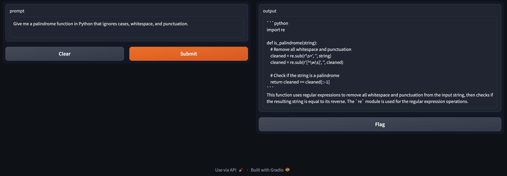

# python-assistant
Python development AI assistant built on CodeLlama

## Screenshot

## Installation
*In Progress*

## Credits
These people have inspired the system instructions that are in the `Modelfile`
- [Sammi Turner](https://github.com/sammi-turner)
- [jordantgh](https://github.com/jordantgh)

Special thanks goes to [Matthew Berman](https://github.com/mberman84) for [this video](https://www.youtube.com/watch?v=rIRkxZSn-A8) on wrapping the Ollama API in a [Gradio](https://www.gradio.app/) UI.
